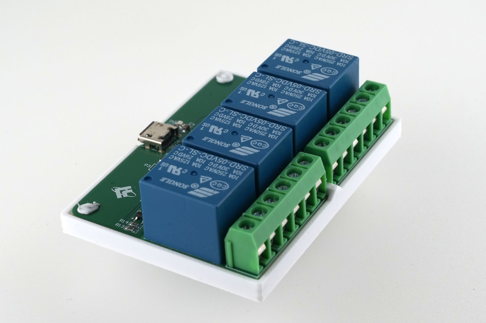

# LCUS HID relay cards

Browsing AliExpress, I stumbled over LCUS "series" relay cards that can be controlled via USB HID - not to be confused with the LCUS relay cards with USB to serial chips.

I was intrigued, but couldn't find ready made python code.

Though, this would great for automation at work and for play. If there's no code, there gotta be code.

## Hardware



- Relays are the ubiquitous Songle 10A/250VAC, 10A/30VDC.
- As brain of the operation, a WCH microcontroller in SSOP-10 (?) package is used. The marking "554EC46" didn't lead to a specific part.
- Unfortunately, there is still a micro USB receptacle, I wish we could have everything-USB-C in 2026.
- Bright red status LEDs - and to my delight they skipped the placebo optocouplers.

In case you're wondering about the backplate - the [STL file is available](LCUS-4_shell.stl) (printed with PETG on a Bambulab P1S).

## Software

The protocol description available in some of the listings basically work, but seem to be limited to setting the relays on/off.

## Dependencies

* [hidapi](https://pypi.org/project/hidapi/)

## API

Basically everything is explained in `example.py` - since everybody is lazy, here you go:

```py
from lcushidrelay import RelayBoard, Relay

# there are multiple ways to control the relays
rb = RelayBoard()

# 1: set_relay method on a RelayBoard object:
rb.set_relay(0, True)

# 2: indexed channel w/ object's value:
rb.ch[1].value = True

# readback is also possible - please note that the initial state is unknown
print(rb.ch[1].value)

# 3: indexed channel w/ method:
rb.ch[2].on()
# or just toggle the relay - please note that the initial state is unknown
rb.ch[3].toggle()

# 4: do some funny stuff with strings:
rb.set_multi_str("HL1T")
# HL1T will set:
# relay 0 high, relay 1 low, relay 2 high, toggle relay 3

# 5: bulk-set relays, optionally with mask
rb.set_multi(0b0000, 0b0001)
```

## Limitations

Unfortunately, the Microcontroller doesn't provide a serial number, adressing multiple relay boards will be a bit cumbersome.

If a particular board is always operated at the same USB port, a mitigation could be (though not substantially tested) to use the device path - that `\\\\?\\HID#VID_5131&PID_2007...`-thing.

The constructor of the `RelayBoard` class offers this as an optional parameter.

## Testing

Currently manually tested with a 4 channel board. Based on the available docs, other variants should just work.